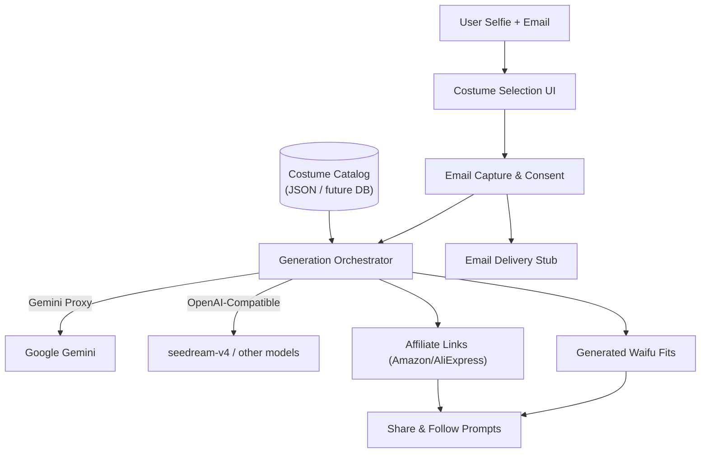

Waifu Material
===============

> "Spook up your selfie." Waifu Material lets gamers, cosplayers, and egirls slip into high-fantasy Halloween costumes without leaving their chair.

Table of Contents
-----------------

- Overview
- Feature Highlights
- User Journey
- Architecture
  - Frontend
  - Generative AI providers
  - Data & content
  - Hosting & deployment
- Costume Catalog Format
- Affiliate & Monetization
- Development Workflow
- Environment Setup
- Running the App
- Testing & QA
- Logging & Analytics
- Roadmap

Overview
--------

Waifu Material is a Vite + React + TypeScript single-page app that transforms a single user photo into multiple anime-inspired Halloween looks. Users pick up to three curated costumes, drop a selfie, provide an email for delivery, and let our AI pipeline (Gemini or OpenAI-compatible models such as `seedream-v4`) do the rest. Affiliate product callouts surface while renders bake, and a social share moment caps the experience. The same core flow will later pivot to winter holidays and other seasonal drops.

Feature Highlights
------------------

- **Curated costume presets** – 6–9 launch outfits with multiple reference shots, prompts, and affiliate product bundles.
- **Multi-model AI stack** – Gemini proxy today, OpenAI-compatible providers tomorrow, all behind a single abstraction.
- **Frictionless UX** – minimal inputs (selfie + email), auto-prompts, optional background cleanup, and glowing UI touches.
- **Affiliate monetization** – during generation we surface Amazon/AliExpress links plus disclosure copy.
- **Analytics-ready** – every key interaction (costume selection, email opt-in, provider usage, affiliate click, social share) is logged.

User Journey
------------

1. **Pick your looks** – select up to three costumes from the catalog.
2. **Upload selfie** – drop a single well-lit portrait (optional crop/background removal).
3. **Enter email** – required to receive renders; we capture consent and store preferences.
4. **Generation lounge** – while images render, showcase costume lore, product links, and other calls to action.
5. **Shareable reveal** – present the AI outputs, download options, and cross-platform share/follow prompts.

Architecture
------------

### Frontend
- Vite 5 + React 18 + TypeScript.
- Tailwind CSS + shadcn/ui components customized for a neon/anime aesthetic.
- State orchestration handled inside `src/components/WaifuMaterialExperience.tsx` with context-friendly helpers.

### Generative AI providers
- Abstraction layer in `src/lib/providers.ts` selects provider + model at runtime.
- Supported out of the gate:
  - Google Gemini via existing `/api/gemini/generate-content` proxy.
  - OpenAI-compatible APIs (e.g., Together, Fireworks, vLLM) routed through configurable base URL + key.
  - Model registry includes `seedream-v4` with room for future additions.
- Reference image bundles per costume sent alongside the user selfie.

### Data & content
- Costume catalog initially loaded from `src/constants/costumes.ts` (JSON-like module).
- Each costume entry defines metadata, prompts, reference images (2–4), and affiliate links.
- Roadmap includes migrating catalog + analytics to Neon or Supabase with an accompanying dashboard.

### Hosting & deployment
- Primary target: **Vercel** (build command `bun run build`, output `dist`).
- Optional CDN/static asset hosting via **Backblaze B2** for heavy costume galleries; upload script TBD.
- Environment configuration supplied via Vercel project settings (see below).

### Diagram library
- All major systems, timelines, and complex flows are documented with Mermaid diagrams. Source files reside in `docs/diagrams/` alongside exported SVG/PNG assets for offline viewing.
- System overview example:



> Exported assets: see `docs/diagrams/system-overview.svg` and `docs/diagrams/system-overview.png` (regenerate via Mermaid CLI when diagrams change).

Costume Catalog Format
----------------------

```ts
type CostumeLink = {
  label: string;
  url: string;
  source: "Amazon" | "AliExpress" | "Etsy" | "Other";
};

type CostumePreset = {
  id: string;
  name: string;
  description: string;
  prompt: string;
  tags: string[];
  referenceImages: string[]; // imported asset paths
  affiliateLinks: CostumeLink[];
  recommendedModel?: string; // e.g., "seedream-v4"
};
```

Initial data lives in `src/constants/costumes.ts`. When we graduate to Neon/Supabase, we will preserve the schema and sync strategy documented in `docs/TODO.md`.

Affiliate & Monetization
------------------------

- Affiliate links appear during the generation state and within the results screen.
- Each link logs `affiliate_link_clicked` with costume/model context.
- Always show disclosure copy (FTC compliance) and ensure tracking parameters are encapsulated in the catalog data.

Development Workflow
--------------------

- **Bun-first** toolchain. npm remains a fallback only when Bun is unavailable.
- Every major change ships on a feature branch with tests + docs updated in lockstep.
- Core documentation to update per change: README, AGENTS.md, CHANGELOG.md, and `docs/TODO.md`.
- Specialized agents/droids may own discrete areas (UI/theme, AI stack, analytics/docs, etc.).

Environment Setup
-----------------

Required variables (configure in `.env.local` or Vercel project settings):

| Variable | Purpose |
| --- | --- |
| `VITE_GEMINI_PROXY_URL` | Overrides default `/api/gemini/generate-content` if needed. |
| `VITE_OPENAI_API_BASE` | Base URL for OpenAI-compatible provider (e.g., https://api.together.xyz/v1). |
| `VITE_OPENAI_API_KEY` | API key/token for the selected OpenAI-compatible provider (never ship to clients; use proxy when possible). |
| `VITE_DEFAULT_MODEL` | Model id to preselect (e.g., `seedream-v4`). |
| `VITE_AFFILIATE_DISCLOSURE` | Optional disclosure copy override. |
| `VITE_EMAIL_ENDPOINT` | Endpoint to receive email opt-ins (stub-friendly; default logs to console). |

Running the App
---------------

Install & run (Bun – preferred):

```sh
bun install
bun run dev
```

Install & run (npm – fallback):

```sh
npm ci
npm run dev
```

> Bun blocks certain native postinstall scripts by default. If prompted, inspect `bun pm untrusted` and trust known libraries (e.g., `@swc/core`) with `bun pm trust`.

Build artifacts (Vercel-compatible):

```sh
bun run build
```

Fallback:

```sh
npm run build
```

Outputs land in `dist/`. Deploy that directory or rely on Vercel’s static output.

Testing & QA
------------

- Lint: `bun run lint` (or `npm run lint`).
- Unit tests (coming soon) will live under `src/__tests__` and execute via `bun test`.
- Manual QA checklist lives in `docs/TODO.md` (kept evergreen per feature branch).

Logging & Analytics
-------------------

- Logging helper in `src/lib/logger.ts` now captures:
  - `costume_selected`, `costume_deselected`
  - `email_submitted`, `email_submit_failed`
  - `generation_started/succeeded/failed`
  - `affiliate_link_clicked`
  - `share_clicked`
  - Provider/model usage metadata
- Data is mirrored to console plus optional beacon endpoint (`VITE_LOG_ENDPOINT`).

Roadmap
-------

- **Phase 1** (this overhaul): neon theme, costume catalog, provider abstraction, affiliate surfacing, email gating, Vercel deployment docs.
- **Phase 2**: dashboard (Supabase/Neon) for managing costumes, tracking stats, and adjusting theme without redeploys.
- **Seasonal pivots**: convert catalog and theme to winter holidays post-Halloween.
- **Backend upgrades**: full email delivery + analytics storage, asset CDN on Backblaze B2.
- **Workflow automation**: CI on Vercel/GitHub Actions with lint/test gates and preview deployments.
